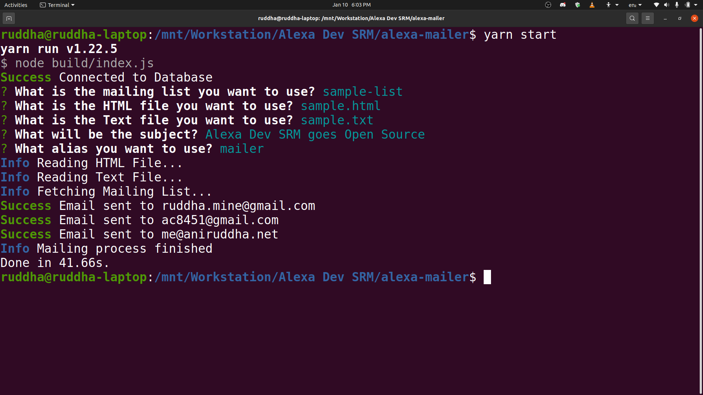

<div align="center">
  
</div>
<div align="center">
  <h2>Alexa Mailer</h2>
</div>

<br>
<p align="center">
A CLI based mailer, leveraging the power of Amazon SES.
</p>
<p align="center">
Created by <a href="https://alexadevsrm.com">Alexa Developers SRM</a>.
</p>
<p align="center">
    
    
    
</p>

## Preview

<div align="center">
  
</div>

## Installation 🔧

Install dependencies and build the server

```
$ yarn && yarn build
```

Start the server

```
$ yarn start
```

## License

`Alexa Mailer` is available under the MIT license. See the LICENSE file for more info.


## Contributing

Please read `Contributing.md` for details on our code of conduct, and the process for submitting pull requests to us.


## Shout outs
The product is build by the following member(s):

| <p align="center"><br>[Aniruddha Chatterjee](https://github.com/ruddha2001)</p> |
| ---------------------------------------------------------------------------------------------------------------------------------------------------- |


## Product Description

### Collection

The CLI uses a default collection named `alexa-mail`. If you wish to change it, set the appropiate name as the evironment variable.

### Document

Each document must confirm to the following structure
```
{
  "name":"list-name",
  "users":[
    {
      "email": "first.email@example.com
      // Any other properties can follow
    },
    {
      "email": "second.email@example.com
      // Any other properties can follow
      // So on...
    }
  ]
}
```

You can add any number of properties that you want to use in your dynamic email content.

### Dynamic Email

This product uses `dot.js` to template the email content. You can use string interpolation as
```
{{=it.property1}}
{{=it.property2}}
// So on...
```
You can use such properties anywhere in the email content, for both HTML and text files. These properties come from the object array defined in the document in use.

Check `example.html` and `example.txt` to learn more.